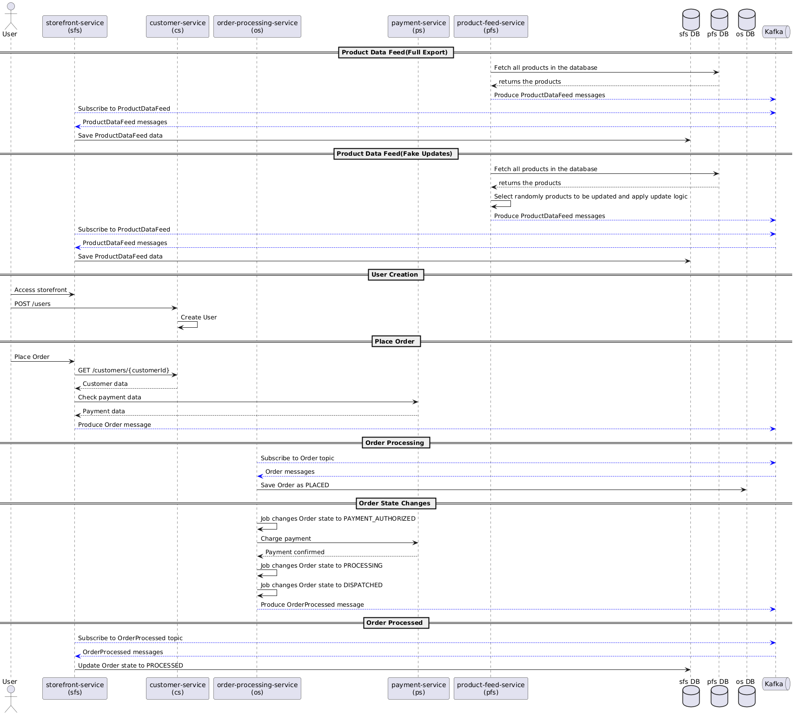

# Advanced-Ecom

Advanced-Ecom is a comprehensive e-commerce platform designed with a microservices architecture. This monorepo project contains several modules, each responsible for a specific domain within the e-commerce ecosystem. All modules are developed using **Java 21** and **Maven**.

## Table of Contents

- [Architecture](#architecture)
- [Modules](#modules)
- [Getting Started](#getting-started)
    - [Prerequisites](#prerequisites)
    - [Running the Application](#running-the-application)
        - [Using Docker Compose](#using-docker-compose)
        - [Running Individual Modules](#running-individual-services)
- [Ports and Services](#ports-and-services)
    - [Infra](#infra)
    - [Application (Docker Compose)](#application-docker-compose)
    - [Application (Individual Services)](#application-individual-services)
    - [Notes](#notes)

- [Technologies Used](#technologies-used)
    - [Programming Languages and Frameworks](#programming-languages-and-frameworks)
    - [Build and Dependency Management](#build-and-dependency-management)
    - [Containerization and Deployment](#containerization-and-deployment)
    - [Messaging and Streaming](#messaging-and-streaming)
    - [Databases and Storage](#databases-and-storage)
    - [Service Discovery and API Gateway](#service-discovery-and-api-gateway)
    - [Inter-Service Communication](#inter-service-communication)
    - [Monitoring and Logging](#monitoring-and-logging)
    - [Documentation](#documentation)
    - [Development Tools](#development-tools)
    - [Others](#others)

## Architecture

Advanced-Ecom is built using a microservices architecture, where each service is designed to handle specific business functionalities independently. The services communicate asynchronously using Kafka and synchronously through REST APIs when necessary. This architecture allows for high scalability and maintainability.



## Modules

The project consists of the following modules:

- **Product Feed Service (PFS)**: Handles product data feeds, sending product updates via Kafka to other services.
- **Storefront Service (SFS)**: Acts as the storefront, consuming product feeds, handling user interactions, and placing orders.
- **Customer Service (CS)**: Manages customer data, including user creation and retrieval.
- **Order Processing Service (OS)**: Processes orders placed by users, manages order states, and communicates with the payment service.
- **Payment Service (PS)**: Manages payment transactions and validates payment information.
- **Service Discovery**: Enables service registration and discovery using Eureka.
- **E-commerce Gateway**: Serves as the API gateway, routing requests to the appropriate services.

## Getting Started

### Prerequisites

#### Docker compose
- **Docker** and **Docker Compose** for containerization.

#### Individual Services
- **Java 21** installed on your machine.
- **Maven** for building the project.
- **Docker** and **Docker Compose** for containerization.

### Cloning the Application
```bash
git clone https://github.com/dias-joaovictor/advanced-ecom.git
cd advanced-ecom
```

### Running the Application

You can run the entire application using Docker Compose or run individual modules separately.

#### Using Docker Compose

To run the entire application with all services:

1. **Start Services**
```bash
docker compose up -u
```

#### Running Individual Services
1. **Start Infra**
```bash
docker compose up -f docker-compose-local.yml -u
```
2. **Access the module you want to run**
3. **Run the app with maven**
```bash
mvn spring-boot:run
```

## Ports and Services

Below is a table summarizing the services, their host, and port configurations:

### Infra

| Service                           | Host        | Port(s)      |
|-----------------------------------|-------------|--------------|
| **Prometheus**                    | localhost   | 9090         |
| **Loki**                          | localhost   | 3100         |
| **Grafana**                       | localhost   | 3000         |
| **Zookeeper**                     | localhost   | 2181         |
| **Kafka**                         | localhost   | 9092, 29092  |
| **PFS MySQL**                     | localhost   | 13306        |
| **SFS MySQL**                     | localhost   | 23306        |
| **CS MySQL**                      | localhost   | 33306        |
| **OS MySQL**                      | localhost   | 43306        |
| **PS MySQL**                      | localhost   | 53306        |

### Application (Docker compose)
| Service                           | Host        | Port(s)      |
|-----------------------------------|-------------|--------------|
| **Service Discovery**             | localhost   | 8761         |
| **E-commerce Gateway**            | localhost   | 9999         |

### Application (Individual services)
| Service                           | Host        | Port(s)      |
|-----------------------------------|-------------|--------------|
| **Product Feed Service (PFS)**    | localhost   | 8080         |
| **Storefront Service (SFS)**      | localhost   | 8081         |
| **Customer Service (CS)**         | localhost   | 8082         |
| **Payment Service (PS)**          | localhost   | 8083         |
| **Order Processing Service (OS)** | localhost   | 8084         |
| **Service Discovery**             | localhost   | 8761         |
| **E-commerce Gateway**            | localhost   | 9999         |

### Notes:

- **Kafka Ports**:
    - `9092`: External access port for the host IP.
    - `29092`: Internal Docker network access port.

- **MySQL Databases**:
    - Each microservice has its own MySQL instance with a unique port for external access.

- **Accessing Services**:
    - You can access the services via `localhost` and their respective ports. For example, to access the **Storefront Service**, navigate to `http://localhost:8081`.

- **Monitoring Tools**:
    - **Prometheus**: `http://localhost:9090`
    - **Grafana**: `http://localhost:3000`
    - **Loki**: Accessible internally on port `3100`.

- **Service Discovery and Gateway**:
    - **Service Discovery** (Eureka): `http://localhost:8761`
    - **E-commerce Gateway**: `http://localhost:9999`

## Technologies Used

Advanced-Ecom leverages a range of modern technologies to provide a robust, scalable, and efficient e-commerce platform. Below is a detailed list of the key technologies used in this project:

### Programming Languages and Frameworks

- **Java 21**: The latest long-term support (LTS) version of Java, offering new features and performance improvements.
- **Spring Boot**: A powerful framework for building production-ready, stand-alone applications with minimal configuration.
- **Spring Cloud**: Provides tools for developers to quickly build common patterns in distributed systems, such as configuration management and service discovery.
- **Spring Cloud Stream**: A framework for building highly scalable, event-driven microservices connected with shared messaging systems like Kafka.
- **Spring Data JPA**: Simplifies data access layers by providing a repository abstraction over JPA implementations.
- **Lombok**: A Java library that minimizes boilerplate code by generating common methods like getters, setters, and constructors at compile time.

### Build and Dependency Management

- **Maven**: A build automation and dependency management tool used for managing project builds and dependencies.

### Containerization and Deployment

- **Docker**: Used to containerize applications, ensuring consistency across different environments.
- **Docker Compose**: Orchestrates multiple Docker containers, allowing for easy setup of multi-container applications.

### Messaging and Streaming

- **Apache Kafka**: A distributed streaming platform used for building real-time data pipelines and streaming applications, facilitating asynchronous communication between microservices.
- **Zookeeper**: Coordinates distributed processes and manages Kafka clusters by maintaining configuration information and providing synchronization.

### Databases and Storage

- **MySQL**: An open-source relational database management system used for data persistence in each microservice.
- **Flyway**: A database migration tool that allows for version control of database schemas, ensuring consistent database structures across environments.

### Service Discovery and API Gateway

- **Eureka**: A service discovery tool from Netflix OSS, used for locating services for load balancing and failover.
- **Spring Cloud Gateway**: Provides a simple yet effective way to route APIs and implement cross-cutting concerns like security and monitoring.

### Inter-Service Communication

- **Feign Client**: A declarative web service client that simplifies HTTP API clients, used for inter-service RESTful communication.
- **Spring Cloud OpenFeign**: Enhances Feign with Spring Cloud integration, allowing for easy use of Feign clients in Spring applications.

### Monitoring and Logging

- **Prometheus**: An open-source monitoring system that collects metrics from configured targets at given intervals.
- **Grafana**: An open-source analytics and interactive visualization web application, providing dashboards and charts for visualizing time-series data.
- **Loki**: A log aggregation system designed to store and query logs from all microservices, integrated with Grafana for seamless log querying.
- **Spring Boot Actuator**: Adds several production-ready features to monitor and manage your application, exposing operational information via REST endpoints.

### Documentation

- **Swagger/OpenAPI**: Used for documenting RESTful APIs, allowing for easy testing and client generation.
- **Springdoc-openapi**: Automates the generation of API documentation in compliance with the OpenAPI 3 specification.

### Development Tools

- **JDK 21**: Java Development Kit for building and running Java applications.
- **Maven Wrapper**: Allows users to run a Maven build without requiring that Maven be installed on the machine.
- **Git**: Version control system for tracking changes in source code during software development.

### Others

- **SLF4J with Logback**: Simple Logging Facade for Java, with Logback as the logging implementation.
